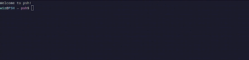
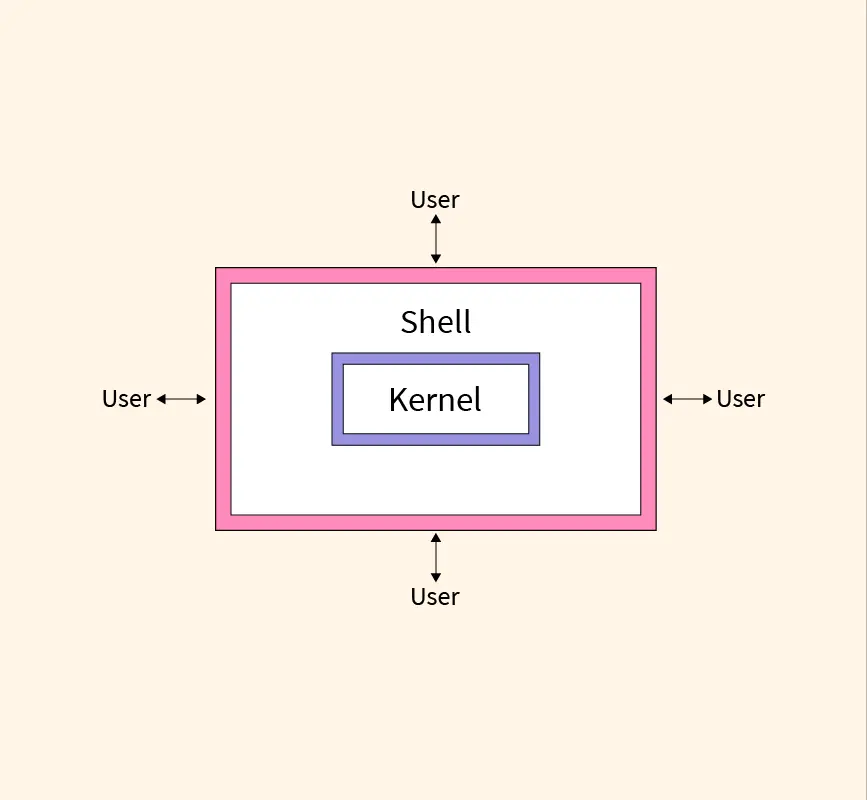
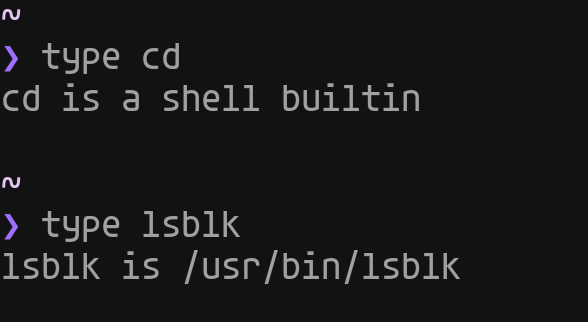
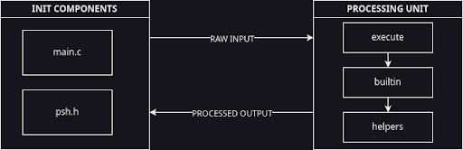
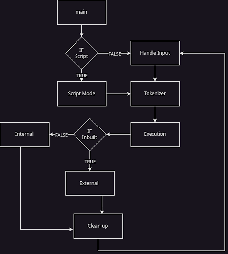
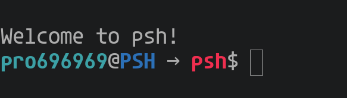
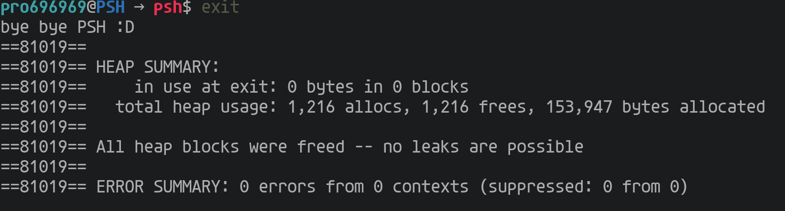
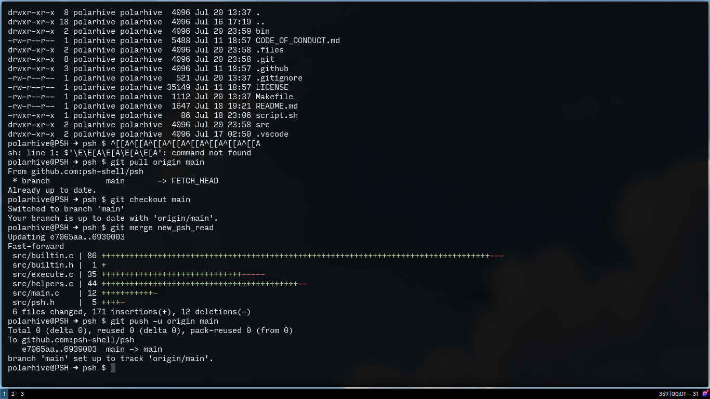
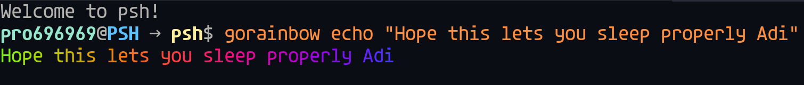

# $ psh: a fancy POSIX-like shell

_Authors : [KK](https://github.com/Pro696969), [Adi](https://github.com/adityatr64), [Alayna](https://github.com/AlaynaMonteiro), [Sumithra](https://github.com/2sumithrasuresh), [Siddhartha](https://github.com/ninsid711)_

## Contents : 

- [Introduction](#introduction)
- [From the ground up](#from-the-ground-up) 
    - [What is a Shell ???](#what-is-a-shell-)
    - [What is POSIX standards](#what-is-posix-standards)
    - [Working of a shell under the hood](#working-of-a-shell-under-the-hood)
- [Genesis](#genesis)
- [All about psh](#all-about-psh)
    - [File Structure](#file-strucure-)
    - [WorkFlow of **psh**](#workflow-of-psh)
    - [Commands](#commands)
    - [Main Features](#main-features)
- [How you can run **psh** locally ?](#how-you-can-run-psh-locally-)
- [Benchmarks](#benchmarks)
- [Experience](#experiences)
- [Fun stuff](#fun-stuff)
- [References](#references)

## Introduction
<!--  -->
- What made us choose this project ?
- As computer science students, we work with shells on a daily basis. Hence, building a shell from scratch was a great opportunity for us to explore its inside workings while tweaking it to match our custom needs.

> It is a part of [Tilde 3.0](https://github.com/homebrew-ec-foss/Tilde-3.0) HSP PESU-ECC's summer mentoring program: where 5 students developed this project under the guidance of 4 mentors.
> Under this program, we have developed psh, a custom POSIX-like compliant shell. It is implemented in C and aims to achieve all features of POSIX compliance while incorporating other features that set it apart

## Contributors:
- [Aditya R](https://github.com/adityatr64)
- [Krishna Kumar](https://github.com/Pro696969)
- [Alayna Monteiro](https://github.com/AlaynaMonteiro)
- [Sumithra Suresh](https://github.com/2sumithrasuresh)
- [Siddhartha Rao](https://github.com/ninsid711)

## Mentors:
- [Nathan Paul](https://github.com/polarhive)
- [Tejas R](https://github.com/tejas-techstack)
- [Anupam G](https://github.com/g-anupam)
- [Navneet Nayak](https://github.com/NavneetNayak)


## From the ground up

- Here is some background info you might require before diving into our project...

### What is a Shell ?

<!--  -->


- A shell is a _cli_ interface that acts as an intermediary between an user and an operating system's kernel 

- Instead of using a graphical interface with buttons and menus, you type commands into the shell to control your system, like managing files or running programs. 

- Examples : bash, zsh, fish


### What is POSIX standards

POSIX is a family of standards, specified by the IEEE, to clarify and make uniform the application programming interfaces provided by Unix operating systems.
 POSIX compliancy implies your shell/shell utility can be ported anywhere across wide range of UNIX (derivatives)

### Working of a shell under the hood 

So here's what exactly happens when you type a command in a shell, lets you want to execute a command call it *'X'* so when you type it in the shell and hit enter. Your shell first checks whether the *'X'* is an shell-builtin or a shell executable..

Whats a shell builtin ? 
-  It is a command or a function, called from a shell, that is executed directly in the shell itself, instead of an external executable program which the shell would load and execute. Shell builtins work significantly faster than external programs, because there is no program loading overhead

Whats a shell executable ?
- These are commands stored in `/usr/bin/` or `/usr/local/bin`



## Genesis

How we started with psh ?
- Firstly we implemented a REPL algorithm which is basically an infinite while loop, awaiting user response for further commands.

## All About **psh**

### File Strucure :
```
├── bin
│   ├── builtin.o
│   ├── execute.o
│   ├── helpers.o
│   ├── main.o
│   └── psh
├── Makefile
├── README.md
├── script.sh
└── src
    ├── builtin.c
    ├── builtin.h
    ├── colors.h
    ├── execute.c
    ├── helpers.c
    ├── main.c
    └── psh.h
```

### WorkFlow of psh 

<br>


### Commands

- We have 2 set of commands
    
    1. shell builtin : `cd`, `exit`, `echo`, `type`, `pwd`, `fc`, `export`, `read`, `alias`, `unalias` 
    2. external : `ls`, `lsblk`, `ssh`, `file`, `script`

### Main Features

- Script mode
- Syntax highlighting
- Signal handling
- Arrow keys
- Auto complete
- Globbing

## How you can run **psh** locally ?

```bash
git clone https://github.com/homebrew-ec-foss/psh 
cd psh
make run
```


## Benchmarks

#### psh is memory efficeint with _almost_ 0 memory leaks
    
#### YESS IT IS VERY MEMORY SAFE 

#### here is `time` to execute a script using `bash` and `psh`
**bash** : 
**psh** : 
#### As you can see psh is _almost_ as fast as bash


## Experiences

It was an overall fUn experience, learning fundamental concepts of os and understanding how shell works 🤯.
We also had a tough time debugging C code as we kept running into segmentation faults, as well as learnt how to use `gdb` to get rid of segmentation faults. We learnt how to handle memory leaks and dynamic memory allocation in a much more efficient manner for a large codebase. Resolving merge conflicts was a new and slightly tedious experience.

Our mentors gave us some wonderful suggestions and feedback as to how to go about making this project. Their support has been instrumental.
Tejas screaming was music to our ears 🥺

## Fun stuff
### here is Nathan merging pr through psh shell 😊 
 
<br>
<br>


## References
- [writing a shell in C](https://brennan.io/2015/01/16/write-a-shell-in-c)
- [POSIX docs](https://www.gnu.org/software/libc/manual/html_node/POSIX.html)
- [Stackoverflow](https://stackoverflow.com/) 
- [colors](https://github.com/Ho-Ro/ComponentTester/blob/main/colors.h)
- [IBM docs](https://www.ibm.com/docs/en)
- [GeeksForGeeks](https://www.geeksforgeeks.org/)
